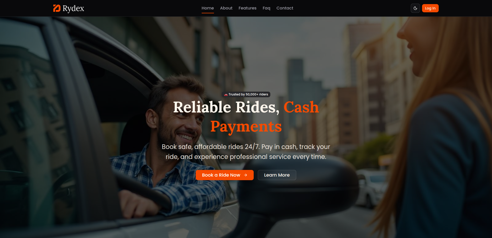

# Rydex - Intelligent Ride Booking Platform (Frontend)


<!--  -->

**Rydex** is a modern, full-stack, role-based ride booking platform designed to provide a seamless and secure experience for riders, drivers, and administrators. Built with a production-grade technology stack, this application demonstrates complex state management, real-time communication, and a robust, scalable architecture.

**Live Frontend URL:** [**https://rydex.vercel.app**](https://rydex.vercel.app)
**Live Backend URL:** [**https://rydex-ride-booking-system-backend.onrender.com**](https://rydex-ride-booking-system-backend.onrender.com)

---

### ⚠️ Important Note for Testing

The backend for this project is hosted on Render's free tier, which automatically spins down the server after 15 minutes of inactivity. **Please click the backend link above and wait 30-60 seconds for it to "wake up" before testing the frontend.** You will see a welcome message when the server is ready.

---

## 🔑 Test Credentials

| Role | Email | Password |
| :--- | :--- | :--- |
| **Admin** | `admin@rydex.com` | `Ad@@1234` |
| **Driver** | `driver.tanjiro@gmail.com` | `Di@@1234` |
| **Rider** | `rider.saidul@gmail.com` | `Ri@@1234` |

---

## ✨ Core Features

### 👨‍💼 Admin Features
- **Analytics Dashboard:** Visualizes key platform metrics like total revenue, ride volume, and user statistics with dynamic charts.
- **User Management:** A comprehensive interface to search, filter, and manage all riders and drivers. Admins can `block/unblock` riders and `approve/suspend` drivers.
- **Ride Oversight:** A complete log of all rides on the platform with advanced filtering and sorting capabilities (by date, fare range, status, etc.).

### 🚗 Driver Features
- **Availability Control:** A real-time toggle to switch between `Online` and `Offline` status, with optimistic UI updates.
- **Incoming Requests:** A paginated and filterable "marketplace" view of available ride requests. Drivers can `accept` or `dismiss` requests.
- **Active Ride Management:** A dedicated, map-based interface to manage ongoing trips with clear, step-by-step actions (`Confirm Pickup`, `Start Trip`, `Complete Ride`).
- **Earnings Dashboard:** A personal analytics page showing total earnings, completed trips, and daily income trends via interactive charts.
- **Ride History:** A detailed, paginated log of all past rides.

### 🧍 Rider Features
- **Dynamic Ride Request:** An interactive map-based form to select pickup and destination, with real-time fare estimation.
- **Active Ride View:** A page to view the current ride status and driver details, with real-time status updates pushed from the server via WebSockets.
- **Ride History:** A paginated and sortable list of all previous trips.
- **Profile Management:** All users can update their personal information and change their passwords.

### 🛡️ General & Safety Features
- **Role-Based Access Control (RBAC):** Secure dashboards and routes tailored to the logged-in user's role (Admin, Driver, or Rider).
- **Real-time Notifications:** Riders receive instant notifications (via Socket.IO) when their ride status is updated (e.g., completed or cancelled).
- **Simulated SOS Button:** A safety feature on the active ride screen for emergency situations.
- **Guided Tour:** A one-time, role-specific guided tour for new users using `react-joyride`.
- **Persistent Dismissals:** A driver's dismissed ride requests are saved to `localStorage` for a seamless session experience.
- **Robust Error Handling:** Professional handling of validation, authorization, and network errors with user-friendly toast notifications.

---

## 🛠️ Technology Stack

| Category | Technology |
| :--- | :--- |
| **Frontend** | React, TypeScript, React Router, Vite |
| **State Management** | Redux Toolkit, RTK Query |
| **Styling** | Tailwind CSS, shadcn/ui |
| **Mapping** | React Leaflet, OpenStreetMap, OSRM (Routing) |
| **Real-time** | Socket.IO Client |
| **UI/UX**| react-hot-toast (Notifications), recharts (Charts), react-joyride (Guided Tour) |
| **Backend** | Node.js, Express.js, TypeScript, Mongoose |
| **Database** | MongoDB |
| **Authentication** | JWT, Passport.js, bcrypt |
| **Deployment** | **Frontend:** Vercel, **Backend:** Render |

---

## 🚀 How to Run Locally

1.  **Clone the repository:**
    ```bash
    git clone [https://github.com/codewithsaidul/ph-assignmen-six](https://github.com/codewithsaidul/ph-assignmen-six)
    cd ph-assignmen-six
    ```
2.  **Install dependencies:**
    ```bash
    bun install
    ```
3.  **Set up environment variables:**
    Create a `.env` file in the root and add the following:
    ```
    VITE_API_BASE_URL=http://localhost:3000/api/v1
    VITE_SOCKET_BACKEND_URL=http://localhost:3000
    ```
4.  **Run the development server:**
    ```bash
    npm run dev
    ```

The application will be available at `http://localhost:5173`.